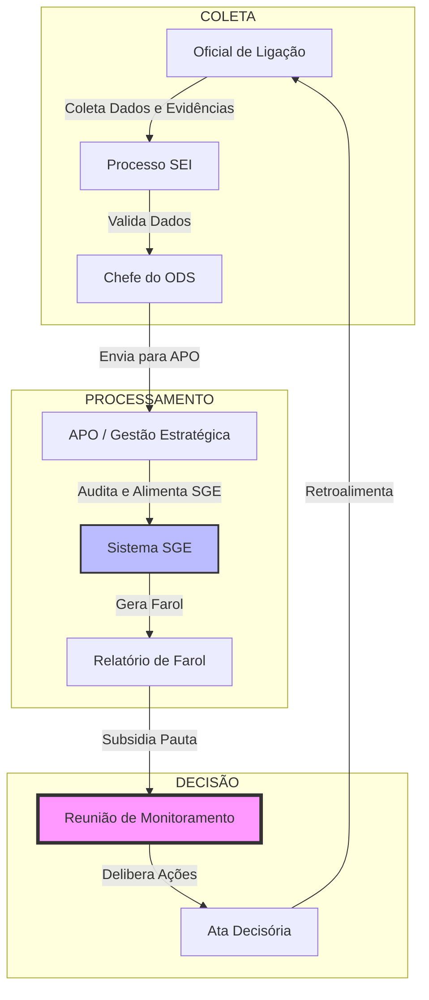
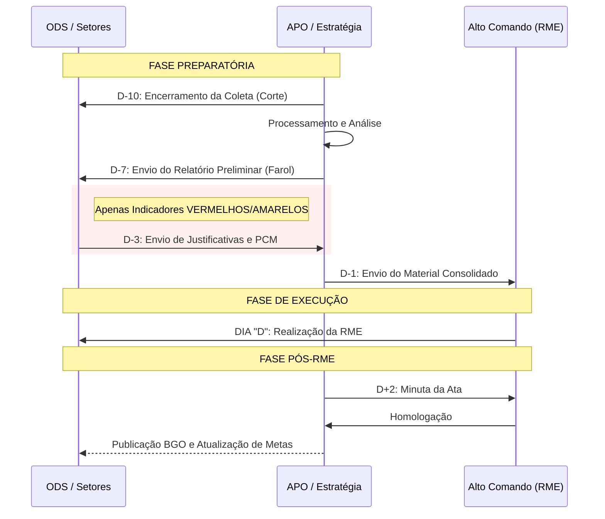
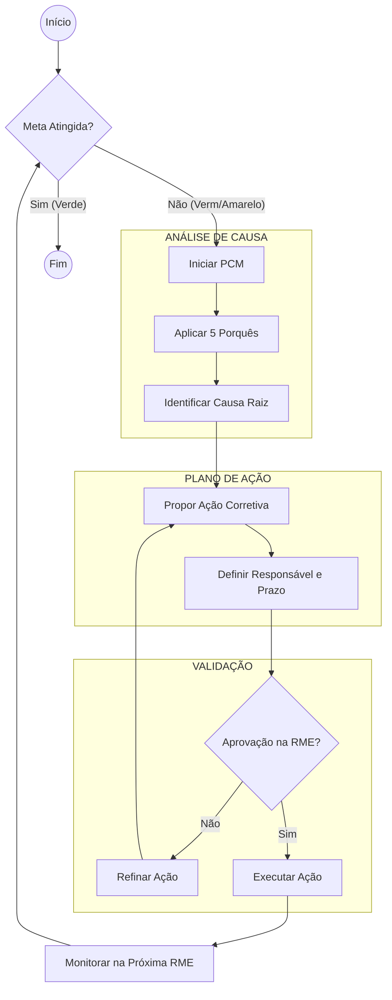
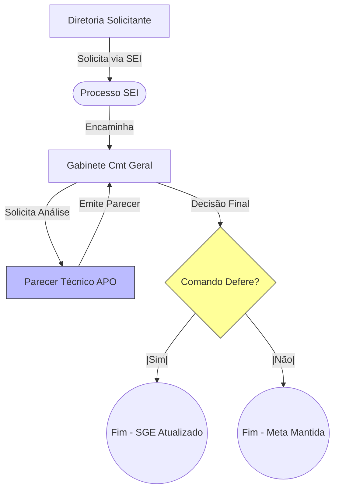

# PROCESSOS DE MONITORAMENTO ESTRATÉGICO (BPMN)
**Anexo ao Plano de Monitoramento da Estratégia 2025-2029**

Este documento detalha os fluxos de trabalho (workflows) citados no Plano de Monitoramento, utilizando notação BPMN simplificada para orientação dos executores.

---

## 1. MACROFLUXO DE MONITORAMENTO (CADEIA DE VALOR)

Visão geral de como o dado sai da ponta (Setor) e vira decisão estratégica (Alto Comando).

---

## 2. RITO DA REUNIÃO DE MONITORAMENTO (RME)

Cronograma reverso de preparação para garantir a efetividade da reunião.

---

## 3. TRATAMENTO DE DESVIOS (PLANO DE CONTRAMEDIDA - PCM)

Fluxo acionado quando uma meta não é atingida.

---

## 4. SOLICITAÇÃO DE ADIAMENTO DE PRAZO

Fluxo excepcional para alteração de datas pactuadas.

