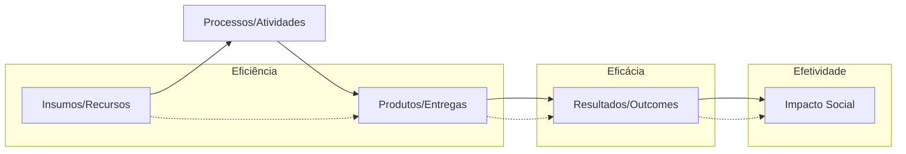

# CORPO DE BOMBEIROS MILITAR DE ALAGOAS
## ESTADO-MAIOR GERAL
### ASSESSORIA DE PLANEJAMENTO E ORÇAMENTO

---

# PLANO DE AVALIAÇÃO DA ESTRATÉGIA INSTITUCIONAL
**Ciclo 2025-2029**

---

**Maceió - AL**
**2026**

---

## SUMÁRIO EXECUTIVO

1. [Apresentação e Finalidade](#1-apresentação-e-finalidade)
2. [Fundamentação Teórica e Metodológica](#2-fundamentação-teórica-e-metodológica)
3. [Critérios de Avaliação](#3-critérios-de-avaliação)
4. [Sistemática de Avaliação](#4-sistemática-de-avaliação)
5. [Governança e Responsabilidades](#5-governança-e-responsabilidades)
6. [Processos e Fluxos](#6-processos-e-fluxos)
7. [Cronograma de Avaliações](#7-cronograma-de-avaliações)
8. [Melhoria Contínua](#8-melhoria-contínua)

---

## 1. APRESENTAÇÃO E FINALIDADE

### 1.1 Contexto Institucional
O Corpo de Bombeiros Militar de Alagoas (CBMAL), em consonância com sua Política de Gestão Estratégica (Atualização 2025-2029) e alinhado às melhores práticas de governança pública recomendadas pelo Tribunal de Contas da União (TCU), institui o presente **Plano de Avaliação da Estratégia Institucional** para o ciclo 2025-2029.

Este instrumento integra o ecossistema de gestão corporativa, complementando o Plano Estratégico, o Plano de Implementação e o Plano de Monitoramento, fechando o ciclo PDCA (Plan-Do-Check-Act) da estratégia organizacional.

### 1.2 Objetivos do Plano
O objetivo primordial deste plano é estabelecer uma metodologia sistematizada para **avaliar** – e não apenas monitorar – o desempenho da estratégia corporativa, permitindo:
1.  **Mensurar o valor público** entregue à sociedade alagoana;
2.  **Verificar a efetividade** das políticas públicas de segurança contra incêndio e pânico;
3.  **Fundamentar a tomada de decisão** do Alto Comando com evidências científicas e dados robustos;
4.  **Promover a accountability** (prestação de contas) e a transparência institucional.

### 1.3 Distinção Conceitual: Monitoramento vs. Avaliação
É fundamental distinguir os dois processos para a correta aplicação deste plano:

| Dimensão | Monitoramento (Acompanhamento) | Avaliação (Julgamento de Valor) |
|:---|:---|:---|
| **Foco** | Operacional e Tático | Estratégico e de Impacto |
| **Periodicidade** | Contínua (Mensal/Bimestral) | Periódica (Anual/Mid-Term/Final) |
| **Objeto** | Indicadores de desempenho, Metas, Prazos | Causas, Efeitos, Impactos, Sustentabilidade |
| **Pergunta** | "Estamos fazendo as coisas corretamente?" | "Estamos fazendo a coisa certa? Ocorreu a mudança desejada?" |
| **Responsável** | Gestores de Projetos e Processos (ODS) | Assessoria de Planejamento (APO) e Avaliadores Externos |

---

## 2. FUNDAMENTAÇÃO TEÓRICA E METODOLÓGICA

A metodologia aqui adotada fundamenta-se nos preceitos de Governança Pública do **Tribunal de Contas da União (TCU)** e na adaptação do **Balanced Scorecard (BSC)** para organizações públicas, conforme práticas observadas em corporações de referência como CBMDF e CBMSC.

### 2.1 O "V de Gowin" da Estratégia Pública
A avaliação estratégica no CBMAL busca responder à questão central: *"A estratégia adotada foi capaz de transformar os recursos públicos em valor social tangível?"*.  Para isso, utiliza-se o conceito de **Cadeia de Valor Público**:

### 2.2 Tipologia da Avaliação
O sistema prevê três momentos distintos de avaliação, cada um com escopo específico:

1.  **Avaliação *Ex-Ante* (Diagnóstica)**: Realizada na fase de planejamento (já concluída para o ciclo 2025-2029), focada na coerência interna e viabilidade do plano.
2.  **Avaliação *Ongoing* (Formativa/Mid-Term)**: Realizada no meio do ciclo (2027), com objetivo de corrigir rumos e ajustar metas. Verifica se a implementação está ocorrendo conforme o planejado.
3.  **Avaliação *Ex-Post* (Somativa/Final)**: Realizada ao final do ciclo (2029/2030), focada no impacto e na sustentabilidade dos resultados alcançados.

### 2.3 Glossário Técnico da Avaliação
Para uniformizar a linguagem e evitar ambiguidades, adotam-se as seguintes definições (fonte: Glossário de Terminologia de Avaliação da OCDE e Referencial de Governança do TCU):

*   **Economicidade**: Minimização dos custos dos recursos utilizados para uma atividade, mantendo a qualidade adequada.
*   **Eficiência**: Relação entre os produtos gerados (bens e serviços) e os insumos empregados. É "fazer mais com menos".
*   **Eficácia**: Grau de alcance das metas e objetivos estabelecidos, independentemente dos custos. É "fazer o que foi proposto".
*   **Efetividade**: Alcance dos resultados pretendidos (mudança na realidade) e o impacto gerado sobre os beneficiários. É "mudar a realidade".
*   **Sustentabilidade**: Continuidade dos benefícios gerados pela intervenção após o seu término.
*   **Benchmark**: Referência de excelência ou melhor prática comparativa.

---

## 3. CRITÉRIOS DE AVALIAÇÃO

A avaliação do Plano Estratégico 2025-2029 será pautada em **cinco dimensões (5Es)**, que constituem os critérios de julgamento a serem aplicados pelos avaliadores:

### 3.1 Dimensão 1: EFICÁCIA (O Cumprimento da Missão)
*   **Definição**: Mede o grau de realização dos 17 Objetivos Estratégicos estabelecidos.
*   **Pergunta-Chave**: *Atingimos as metas propostas para os indicadores estratégicos?*
*   **Evidência**: Relatório de Farol da Estratégia (Físico vs. Planejado).

### 3.2 Dimensão 2: EFICIÊNCIA (A Otimização dos Recursos)
*   **Definição**: Mede a produtividade e a relação custo-benefício das iniciativas.
*   **Pergunta-Chave**: *Os processos foram executados com o menor custo/tempo possível, mantendo a qualidade?*
*   **Evidência**: Taxa de execução orçamentária, tempo médio de resposta, custo por atendimento.

### 3.3 Dimensão 3: EFETIVIDADE (O Impacto Social)
*   **Definição**: Mede a mudança real na qualidade de vida da sociedade e na redução de riscos.
*   **Pergunta-Chave**: *Houve redução real nos índices de sinistros e aumento da sensação de segurança?*
*   **Evidência**: Estatísticas de salvamentos, vidas preservadas, bens salvos, pesquisa de satisfação.

### 3.4 Dimensão 4: ECONOMICIDADE (A Gestão Fiscal)
*   **Definição**: Mede a prudência e a qualidade do gasto público.
*   **Pergunta-Chave**: *As aquisições e contratações respeitaram os princípios de menor preço e qualidade técnica?*
*   **Evidência**: Relatórios de auditoria interna, economicidade em licitações.

### 3.5 Dimensão 5: SUSTENTABILIDADE (A Continuidade)
*   **Definição**: Mede a capacidade da instituição de manter os resultados a longo prazo.
*   **Pergunta-Chave**: *As melhorias implementadas são perenes ou dependem de esforços pontuais?*
*   **Evidência**: Institucionalização de processos, normatização, cultura organizacional.

---

## 4. SISTEMÁTICA DE AVALIAÇÃO

### 4.1 Periodicidade e Escopo

| Tipo de Avaliação | Periodicidade | Escopo | Responsável | Objetivo |
|:---|:---|:---|:---|:---|
| **Monitoramento Mensal** | Mensal | Operacional | Gestores de Indicadores | Verificar desvios pontuais e corrigir rotas imediatas. |
| **RME (Reunião de Monitoramento)** | Trimestral | Tático-Estratégico | ODS + APO | Analisar o farol da estratégia e deliberar sobre planos de ação. |
| **Avaliação Anual** | Anual (Jan) | Estratégico | APO + Alto Comando | Validar o desempenho do ano e ajustar metas para o ano seguinte. |
| **Avaliação Mid-Term** | 2027 (Jun) | Revisão Estratégica | Comissão Especial | Revisar a validade dos Objetivos Estratégicos e premissas do plano. |
| **Avaliação Final (Ex-Post)** | 2030 (Jan) | Legado e Impacto | Avaliador Externo (Ideal) | Mensurar o impacto final do ciclo 2025-2029. |

### 4.2 Métodos de Coleta
1.  **Análise Documental**: Verificação de Atas de RME, Relatórios de Gestão e Processos SEI.
2.  **Dados Secundários**: Extração de dados dos sistemas corporativos (SysBM, SAPS, SIAFE).
3.  **Pesquisas de Percepção**: Aplicação de questionários (survey) com o público interno (clima) e externo (satisfação).
4.  **Grupos Focais**: Entrevistas qualitativas com stakeholders chave (Oficiais, Praças, Sociedade Civil).

---

## 5. GOVERNANÇA E RESPONSABILIDADES

A governança da avaliação garante a isenção e a tecnicidade do processo.

### 5.1 Matriz RACI da Avaliação

| Ator | Papel | Responsabilidades |
|:---|:---|:---|
| **Comando Geral / EMG** | *Accountable* (Aprovador) | Validar os relatórios de avaliação e determinar correções de rumo estratégicas. |
| **Assessoria de Planejamento (APO)** | *Responsible* (Executor) | Conduzir o processo de avaliação, coletar dados, analisar evidências e redigir o relatório. |
| **Órgãos de Direção Setorial (ODS)** | *Consulted* (Consultado) | Fornecer dados primários, justificar desvios e propor melhorias setoriais. |
| **Controladoria / Corregedoria** | *Informed* (Informado) | Receber os relatórios para fins de controle interno e conformidade. |

### 5.2 Comissão de Avaliação da Estratégia
Para a **Avaliação Mid-Term (2027)** e **Ex-Post (2029)**, será instituída por portaria uma Comissão Especial composta por:
*   Chefe do EMG (Presidente)
*   Chefe da APO (Relator)
*   Representantes dos Sistemas (Operacional, Administrativo, Ensino)
*   Membro convidado (externo, se possível - ex: Universidade ou outro CBM).

---

## 6. PROCESSOS E FLUXOS

O rito de avaliação segue processos mapeados em BPMN (anexos a este plano):

### 6.1 Processo de Avaliação Anual (Proc-Aval-01)
1.  **Coleta**: APO solicita dados consolidados aos ODS (Jan 26).
2.  **Análise**: APO confronta Realizado vs. Meta e analisa justificativas.
3.  **Redação**: Elaboração da Minuta do Relatório de Avaliação.
4.  **Validação**: Reunião com ODS para validar dados.
5.  **Aprovação**: Apresentação ao Alto Comando.
6.  **Publicação**: Divulgação em Boletim Geral.

### 6.2 Ciclo de Feedback (Retroalimentação)
Os resultados da avaliação DEVEM gerar insumos para o **Ciclo Orçamentário**.
*   Iniciativas com baixo desempenho e alto custo -> **Descontinuar**.
*   Iniciativas com alto impacto -> **Priorizar Recursos**.

---

## 7. CRONOGRAMA DE AVALIAÇÕES 2025-2029

| Ano | Mês | Evento | Entregável |
|:---|:---|:---|:---|
| **2026** | Janeiro | 1ª Avaliação Anual (Ref. 2025) | Relatório de Desempenho 2025 |
| **2027** | Janeiro | 2ª Avaliação Anual (Ref. 2026) | Relatório de Desempenho 2026 |
| **2027** | Jun-Ago | **Avaliação Mid-Term** | Relatório de Revisão Estratégica (Ajuste de Rumo) |
| **2028** | Janeiro | 3ª Avaliação Anual (Ref. 2027) | Relatório de Desempenho 2027 |
| **2029** | Janeiro | 4ª Avaliação Anual (Ref. 2028) | Relatório de Desempenho 2028 |
| **2030** | Fev-Mar | **Avaliação Final Ex-Post** | Relatório de Impacto do Ciclo 2025-2029 |

---

## 8. MELHORIA CONTÍNUA

Este próprio Plano de Avaliação é objeto de revisão. A cada ciclo de avaliação, a APO deve registrar as "Lições Aprendidas" sobre a metodologia:
1.  Os indicadores foram fáceis de coletar?
2.  Os critérios de avaliação foram claros?
3.  O relatório gerou decisão ou foi apenas burocrático?

Com base nessas respostas, a metodologia poderá ser simplificada ou aprimorada para o ciclo seguinte.

---
## AUTORIDADES

**COMANDANTE-GERAL DO CBMAL:**
Cel QOEM BM Sérgio André Silva Verçosa

**CHEFE DO ESTADO-MAIOR GERAL:**
Cel QOEM BM Eduardo Hercules da Silva Justo

**ASSESSOR DE PLANEJAMENTO E ORÇAMENTO:**
TC QOEM BM Marcos Paulo Seara Barbosa

**CHEFE DA SEÇÃO DE GESTÃO ESTRATÉGICA:**
1º Ten QOEM Gabriel Dantas da Cruz

---
**Data da Aprovação:** ______ de ____________ de 2026.
