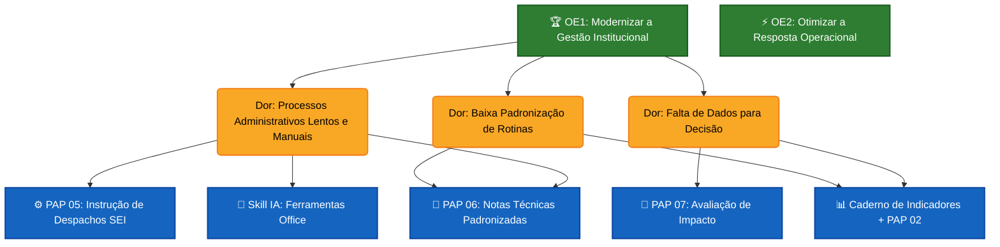

# 🌳 Árvore de Oportunidades (OST) - CBMAL 2025-2029

> **Metodologia:** Teresa Torres (Opportunity Solution Tree)
> **Objetivo:** Garantir que todo PAP ou Projeto ataque uma dor real que impede um Objetivo Estratégico.

## 🗺️ Mapa de Impacto

---

## 🔬 Discovery Contínuo (Anotações)

### Oportunidade: "Processos Administrativos Lentos"
- **Hipótese:** Se padronizarmos a escrita de notas técnicas, reduziremos o tempo de revisão em 50%.
- **Validação:** O *PAP 06* foi implementado e a Skill `redacao-oficial` automatizou a formatação. Resultado: Tempo médio caiu drasticamente.

### Oportunidade: "Falta de Dados para Decisão"
- **Hipótese:** Se tivermos um painel de indicadores automático, o Comando poderá corrigir rotas mensalmente.
- **Experimento:** O *Painel de Controle* + *Caderno de Indicadores* estão ativos. Próximo passo: Validar se estão sendo consultados.

---
**Ultima Atualização:** 19/01/2026
