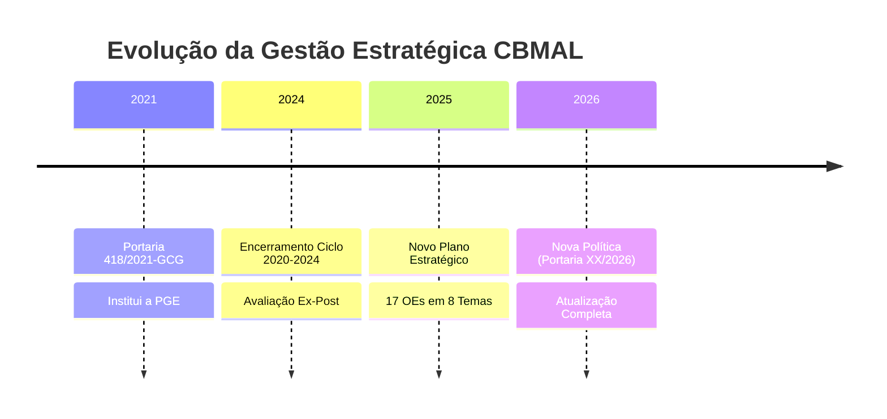
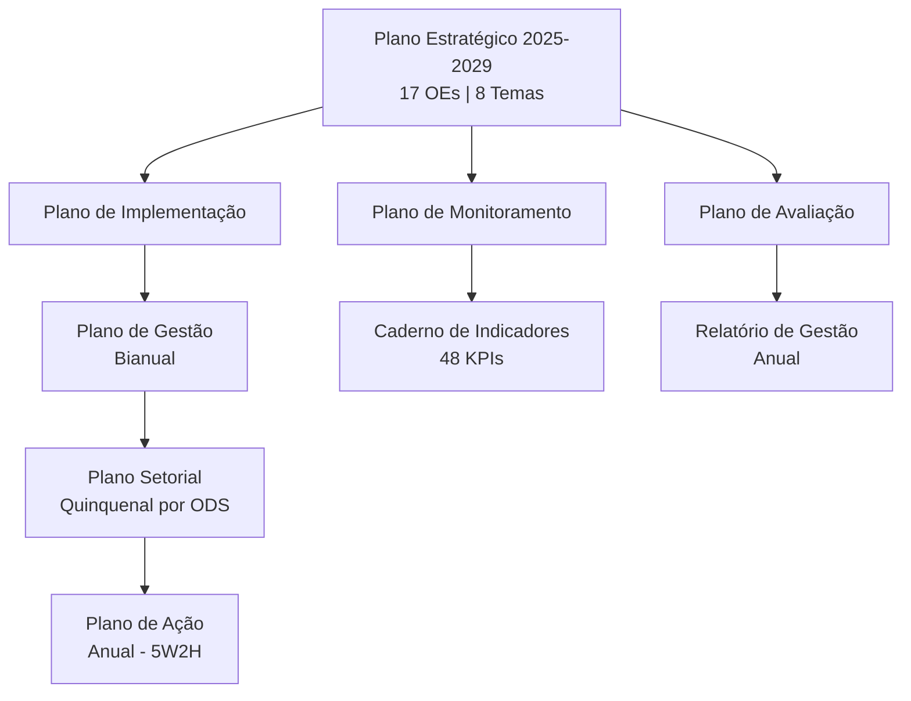
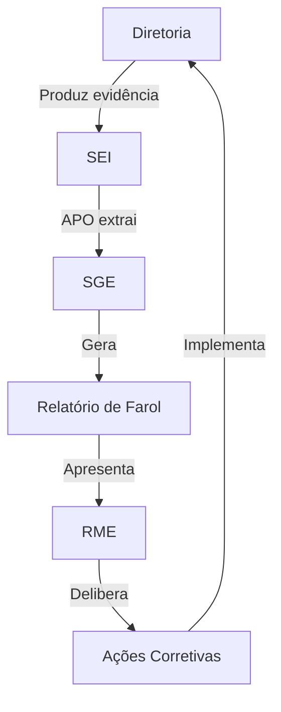
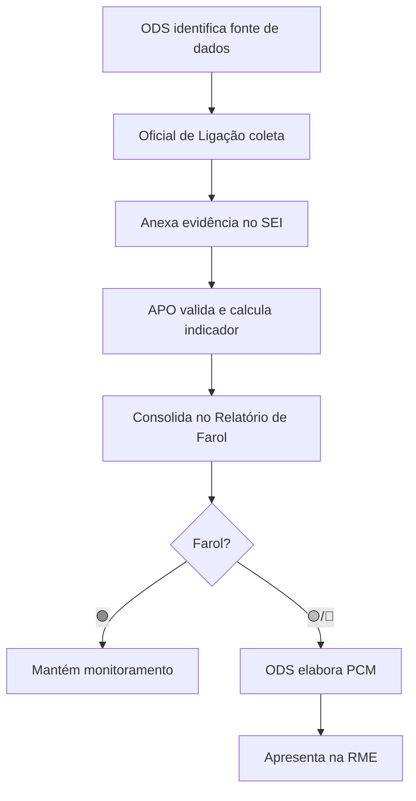
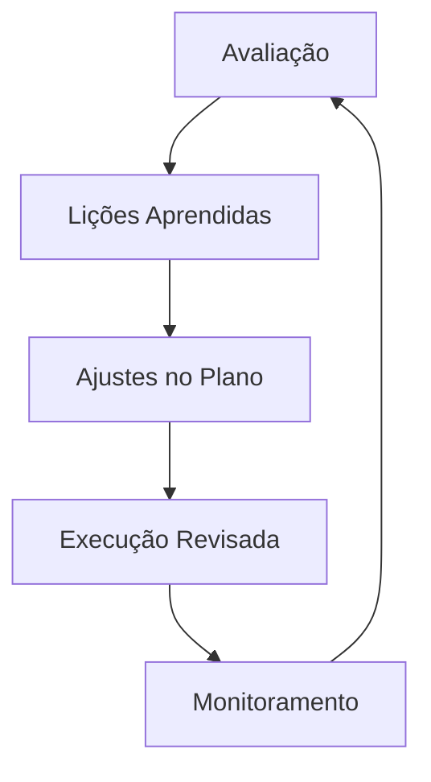

<!-- SLIDE 1: CAPA -->
# CORPO DE BOMBEIROS MILITAR DE ALAGOAS

## Avanços do Planejamento Estratégico
### Ciclo 2025-2029

---

**Assessoria de Planejamento e Orçamento (APO)**
**Estado-Maior Geral**

📅 18 de Janeiro de 2026

---

<!-- SLIDE 2: AGENDA -->
# 📋 Agenda

| Seção | Tema | Tempo |
|:---:|:---|:---:|
| **1** | Atualização da Política Estratégica | 8 min |
| **2** | Plano de Monitoramento | 7 min |
| **3** | Caderno de Indicadores | 8 min |
| **4** | Plano de Avaliação | 6 min |
| **5** | Soluções de Automação (IA) | 10 min |
| | **Q&A** | 6 min |

**Tempo Total: 45 minutos**

---

<!-- SEÇÃO 1: POLÍTICA ESTRATÉGICA -->
# SEÇÃO 1
## Atualização da Política de Gestão Estratégica

---

<!-- SLIDE 3: CONTEXTO -->
# 🔄 Contexto: Transição de Ciclos

> **Objetivo:** Adequar a política às lições aprendidas e ao novo ciclo estratégico.

---

<!-- SLIDE 4: COMPARATIVO -->
# ⚖️ Quadro Comparativo: Antes vs. Depois

| Dimensão | **Portaria 418/2021** | **Nova Política 2026** |
|:---|:---|:---|
| **Tecnologia** | Foco em digitalização básica | IA e Inovação Ética |
| **Pessoas** | Menção genérica | Gestão por Competências |
| **Monitoramento** | RME Genérica | Vinculada a Planos específicos |
| **Governança** | Portarias antigas | Alinhada à Portaria 178/2024 |
| **Instrumentos** | 6 instrumentos | **11 instrumentos** formalizados |
| **Princípios** | 5 princípios | **9 princípios** (+ Transparência, Accountability, Flexibilidade) |

---

<!-- SLIDE 5: INOVAÇÕES -->
# 🚀 Principais Inovações

### Novos Princípios Estratégicos
1. ✅ **Transparência** – Publicização dos atos e resultados
2. ✅ **Accountability** – Prestação de contas pelas entregas
3. ✅ **Integração de Níveis** – Articulação Estratégico-Tático-Operacional
4. ✅ **Adaptação e Flexibilidade** – Revisões conforme contexto

### Novas Competências Formalizadas
- **Gestão por Competências** (Art. 2º)
- **Oficial de Ligação** com atribuições detalhadas (Art. 10)
- **Plano de Contramedida (PCM)** obrigatório para farol vermelho

---

<!-- SLIDE 6: NOVOS INSTRUMENTOS -->
# 📑 Novos Instrumentos da Gestão Estratégica

| Nº | Instrumento | Novidade? |
|:---:|:---|:---:|
| I | Diagnóstico Estratégico | ➖ |
| II | Plano Estratégico | ➖ |
| III | Mapa Estratégico | ➖ |
| **IV** | **Plano de Implementação** | ✅ NOVO |
| **V** | **Plano de Monitoramento** | ✅ NOVO |
| **VI** | **Plano de Avaliação** | ✅ NOVO |
| VII | Caderno de Indicadores | ➖ |
| VIII | Plano de Gestão | ➖ |
| IX | Plano Setorial | Atualizado (GUT + RACI) |
| X | Plano de Ação | ➖ |
| XI | Sistema de Gestão Estratégica (SGE) | ➖ |

---

<!-- SLIDE 7: HIERARQUIA DOCUMENTAL -->
# 📊 Hierarquia Documental Atualizada

---

<!-- SLIDE 8: STATUS -->
# ✅ Status: Pronto para Publicação

| Documento | Status | Próximo Passo |
|:---|:---:|:---|
| Política de Gestão Estratégica | 🟢 Concluído | Publicação em BGO via SEI |
| Plano de Implementação | 🟢 Concluído | Anexo à Portaria |
| Plano de Monitoramento | 🟢 Concluído | Anexo à Portaria |
| Plano de Avaliação | 🟢 Concluído | Anexo à Portaria |
| Caderno de Indicadores | 🟢 Concluído | Divulgação aos ODS |

> **📌 Ação Imediata:** Submeter minuta para apreciação do Comando-Geral.

---

<!-- SEÇÃO 2: PLANO DE MONITORAMENTO -->
# SEÇÃO 2
## Plano de Monitoramento da Estratégia

---

<!-- SLIDE 9: CONCEITO -->
# 🔍 O que é Monitoramento?

> **Definição:** Vigilância ativa e contínua sobre a execução da estratégia, fornecendo informações tempestivas para tomada de decisão.

### ❌ O que NÃO é:
- Fiscalização punitiva
- Auditoria de conformidade
- Busca por culpados

### ✅ O que É:
- Identificar desvios antecipadamente
- Celebrar conquistas (vitórias curtas)
- Promover aprendizado organizacional

---

<!-- SLIDE 10: GOVERNANÇA -->
# 👥 Governança e Atores (Matriz RACI)

| Ator | Papel |
|:---|:---|
| **Oficial de Ligação** | Coleta e alimenta indicadores |
| **Titular do ODS** | Valida dados e justifica desvios |
| **APO** | Analisa, audita e assessora |
| **RME** | Delibera sobre problemas complexos |
| **Alto Comando** | Homologa resultados e decide rumos |

---

<!-- SLIDE 11: CALENDÁRIO RME -->
# 📅 Calendário das RMEs

| RME | Trimestre | Data Prevista | Escopo |
|:---:|:---|:---|:---|
| **1ª** | Jan-Mar | 2ª quinzena **Maio** | Avaliação inicial |
| **2ª** | Abr-Jun | 2ª quinzena **Agosto** | Correção de rumo |
| **3ª** | Jul-Set | 2ª quinzena **Novembro** | Reta final |
| **4ª** | Out-Dez | 2ª quinzena **Fevereiro** | Balanço anual |

> **Regra:** Participação dos Chefes de ODS é **indelegável**.

---

<!-- SLIDE 12: FLUXO DE DADOS -->
# 🔄 Fluxo de Dados

**Ciclo PDCA em ação!**

---

<!-- SLIDE 13: FAROL -->
# 🚦 Sistema de Farol (Semaforização)

| Farol | Significado | Ação Requerida |
|:---:|:---|:---|
| 🟢 **Verde** | Meta atingida ou superada | Manter monitoramento |
| 🟡 **Amarelo** | Desempenho ≥ 80% da meta | Atenção e ajustes táticos |
| 🔴 **Vermelho** | Desempenho < 80% da meta | **PCM obrigatório** |

> **PCM = Plano de Contramedida** (Análise 5 Porquês + Ação Corretiva)

---

<!-- SEÇÃO 3: CADERNO DE INDICADORES -->
# SEÇÃO 3
## Caderno de Indicadores Estratégicos

---

<!-- SLIDE 14: ESTRUTURA -->
# 📊 Estrutura: 48 Indicadores em 3 Níveis

| Nível | Foco | Periodicidade | Monitorado por |
|:---|:---|:---|:---|
| **Estratégico (IE)** | Resultado/Impacto | Trimestral | Alto Comando |
| **Tático (IT)** | Entrega/Projeto | Mensal | ODS + APO |
| **Operacional (IO)** | Esforço/Insumo | Semanal | Setores |

**Total: 48 indicadores (IE-01 a IE-48)**

---

<!-- SLIDE 15: MATRIZ OE x INDICADORES -->
# 🎯 Matriz: 17 OEs → 48 Indicadores

| Tema | OEs | Indicadores |
|:---|:---:|:---:|
| **1. Operacional** | OE.01-03 | 10 |
| **2. Governança** | OE.04-05 | 6 |
| **3. Comunicação** | OE.06-07 | 6 |
| **4. Pessoas** | OE.08-11 | 9 |
| **5. Conhecimento** | OE.12-13 | 6 |
| **6. Transformação Digital** | OE.14 | 3 |
| **7. Infraestrutura** | OE.15 | 3 |
| **8. Finanças** | OE.16-17 | 5 |
| **TOTAL** | **17** | **48** |

---

<!-- SLIDE 16: FICHA TÉCNICA -->
# 📋 Exemplo: Ficha Técnica IE-05

| Campo            | Descrição                                             |          |        |
| :--------------- | :---------------------------------------------------- | -------- | ------ |
| **Nome**         | Tempo Resposta Operacional (TRO)                      |          |        |
| **OE Vinculado** | OE.02 - Aperfeiçoar Gestão Operacional                |          |        |
| **Fórmula**      | `Σ(Hora Chegada - Hora Despacho) / Total Ocorrências` |          |        |
| **Unidade**      | Minutos                                               |          |        |
| **Fonte**        | SysBM / SGO Fênix                                     |          |        |
| **Responsável**  | COB / Seção Estatística                               |          |        |
| **Meta 2025**    | ≤ 10 min                                              |          |        |
| **Farol**        | 🟢 ≤10                                                | 🟡 10-12 | 🔴 >12 |

---

<!-- SLIDE 17: CALENDÁRIO DE COLETA -->
# 📆 Calendário de Coleta

| Indicador | Jan | Fev | Mar | Abr | Mai | Jun | Jul | Ago | Set | Out | Nov | Dez |
|:---|:---:|:---:|:---:|:---:|:---:|:---:|:---:|:---:|:---:|:---:|:---:|:---:|
| **IE-05** (TRO) | ● | ● | ● | ● | ● | ● | ● | ● | ● | ● | ● | ● |
| **IE-02** (Vistorias) | | | | | | ● | | | | | | ● |
| **IE-15** (RME) | | | | | ● | | | ● | | | ● | ● |
| **IE-47** (Orçamento) | | | ● | | | ● | | | ● | | | ● |

**Legenda:** ● = Coleta obrigatória

---

<!-- SLIDE 18: DOCUMENTOS COMPLEMENTARES -->
# 📎 Documentos Complementares

1. **Fichas Técnicas Consolidadas** – Detalhamento dos 48 indicadores
2. **Checklist SMART** – Validação técnica dos indicadores
3. **Matriz de Rastreabilidade** – OE ↔ Indicador ↔ Iniciativa
4. **Relatório Modelo 2025** – Template padrão anual
5. **Referências ABNT** – Fontes bibliográficas

> Todos disponíveis em `01_Estrategia_Corporativa/Caderno_de_Indicadores/`

---

<!-- SLIDE 19: PROCESSO DE COLETA -->
# 🔄 Processo de Coleta e Análise

---

<!-- SEÇÃO 4: PLANO DE AVALIAÇÃO -->
# SEÇÃO 4
## Plano de Avaliação da Estratégia

---

<!-- SLIDE 20: DISTINÇÃO -->
# 🔬 Monitoramento vs. Avaliação

| Dimensão | Monitoramento | Avaliação |
|:---|:---|:---|
| **Foco** | Operacional/Tático | Estratégico/Impacto |
| **Periodicidade** | Contínua (Mensal) | Periódica (Anual/Final) |
| **Pergunta** | "Estamos fazendo certo?" | "Estamos fazendo a coisa certa?" |
| **Objeto** | Metas, Prazos, KPIs | Causas, Efeitos, Impacto |
| **Responsável** | Gestores (ODS) | APO + Avaliadores |

---

<!-- SLIDE 21: CRITÉRIOS 5Es -->
# 🎯 Critérios de Avaliação: Os 5Es

| Critério | Pergunta-Chave |
|:---|:---|
| **Eficácia** | Atingimos as metas propostas? |
| **Eficiência** | Fizemos com menor custo/tempo? |
| **Efetividade** | Houve mudança real na sociedade? |
| **Economicidade** | Gasto público foi prudente? |
| **Sustentabilidade** | Melhorias são perenes? |

> Baseado no Referencial de Governança do **TCU**.

---

<!-- SLIDE 22: CRONOGRAMA DE AVALIAÇÕES -->
# 📅 Cronograma de Avaliações 2025-2030

| Ano | Evento | Entregável |
|:---|:---|:---|
| **2026** Jan | 1ª Avaliação Anual | Relatório 2025 |
| **2027** Jan | 2ª Avaliação Anual | Relatório 2026 |
| **2027** Jun-Ago | **Avaliação Mid-Term** | Revisão Estratégica |
| **2028** Jan | 3ª Avaliação Anual | Relatório 2027 |
| **2029** Jan | 4ª Avaliação Anual | Relatório 2028 |
| **2030** Fev-Mar | **Avaliação Ex-Post** | Relatório de Impacto |

---

<!-- SLIDE 23: MELHORIA CONTÍNUA -->
# 🔄 Ciclo de Feedback e Melhoria

**Perguntas de Autoavaliação:**
1. Os indicadores foram fáceis de coletar?
2. Os critérios de avaliação foram claros?
3. O relatório gerou decisão ou foi burocrático?

---

<!-- SEÇÃO 5: SOLUÇÕES DE AUTOMAÇÃO -->
# SEÇÃO 5
## Soluções de Automação para Funções Administrativas

---

<!-- SLIDE 24: VISÃO GERAL -->
# 🤖 11 Skills/Agentes Desenvolvidos

| Categoria | Skills |
|:---|:---|
| **Estratégicas (CBMAL)** | `gestao-estrategica`, `escritorio-projetos`, `conagc-governanca`, `inteligencia-dados`, `especialista-paps`, `especialista-sei`, `bpmn-modeling`, `gestao-mudanca`, `secretario-executivo`, `redacao-oficial`, `inteligencia-documental` |

> **Conceito:** Assistentes IA especializados que seguem regras e metodologias do CBMAL.

---

<!-- SLIDE 25: CRIADOR DE PAPs -->
# 📝 Especialista em PAPs

### Funcionalidades:
- ✅ Criação de PAPs no padrão CBMAL
- ✅ Revisão e validação de estrutura
- ✅ Geração de fluxogramas vinculados
- ✅ Checklist de conformidade

### Benefícios:
- ⏱️ Redução de 70% no tempo de elaboração
- 📊 Padronização garantida
- 🔄 Atualizações automáticas

---

<!-- SLIDE 26: ANALISTA DE DADOS -->
# 📊 Inteligência de Dados

### Capacidades:
- ✅ Extração e tratamento (ETL)
- ✅ Criação de dashboards
- ✅ Análise de indicadores
- ✅ Geração de relatórios automáticos

### Aplicações:
- Monitoramento do Farol da Estratégia
- Consolidação de dados de ocorrências
- Análise de tendências e projeções

---

<!-- SLIDE 27: ANALISTA DE DOCUMENTOS -->
# 📄 Inteligência Documental

### Automações:
- ✅ Conversão PDF → Markdown (OCR)
- ✅ Extração de tabelas e dados
- ✅ Indexação para pesquisa
- ✅ Comparação de versões

### Tecnologia:
- Docling (IBM) para OCR avançado
- Suporte a documentos escaneados

---

<!-- SLIDE 28: ORGANIZADOR DE PASTAS -->
# 📁 File Organizer

### Fluxo de Trabalho:
1. Análise da estrutura atual
2. Identificação de duplicatas
3. Proposta de reorganização
4. Execução automatizada

### Benefícios:
- 🗂️ Estrutura padronizada
- 🔍 Localização rápida
- 💾 Economia de espaço

---

<!-- SLIDE 29: SECRETÁRIO VIRTUAL -->
# 🗓️ Secretário Executivo

### Tarefas Automatizadas:
- ✅ Briefings diários
- ✅ Gestão de agenda
- ✅ Acompanhamento de pendências
- ✅ Lembretes de prazos
- ✅ Preparação de reuniões

### Integração:
- Kanban Estratégico
- Notas Diárias
- Calendário de RMEs

---

<!-- SLIDE 30: PLANEJADOR DE PROCESSOS -->
# 📋 Gestão Estratégica + PMO

### Metodologias Aplicadas:
- ✅ Balanced Scorecard (BSC)
- ✅ Ciclo PDCA
- ✅ Matriz GUT para priorização
- ✅ Matriz RACI para responsabilidades
- ✅ MGP-CBMAL para projetos

### Ferramentas:
- Templates padronizados
- Checklists de validação
- Fluxos automatizados

---

<!-- SLIDE 31: ESPECIALISTA BPMN -->
# 🔄 Modelagem BPMN 2.0

### Modelagens Realizadas:
- ✅ Macrofluxo de Monitoramento
- ✅ Processo de Avaliação Anual
- ✅ Fluxo de Coleta de Indicadores
- ✅ Processo de RME

### Formato:
- Arquivos `.bpmn` (padrão OMG)
- Visualização em Obsidian/Draw.io
- Canvas interativos

---

<!-- ENCERRAMENTO -->
# ENCERRAMENTO
## Próximos Passos e Q&A

---

<!-- SLIDE 32: PRÓXIMOS PASSOS -->
# 📌 Próximos Passos

| Ação | Responsável | Prazo |
|:---|:---|:---|
| Submeter Política ao Comando-Geral | APO | Jan/26 |
| Publicar Portaria em BGO | GCG | Fev/26 |
| Capacitação de Oficiais de Ligação | APO + DE | Mar/26 |
| 1ª RME do Ciclo 2025-2029 | Todos ODS | Mai/26 |
| Avaliação Anual 2025 | APO | Jan/26 |

---

<!-- SLIDE 33: Q&A -->
# ❓ Perguntas e Respostas

---

## Contatos

**Assessoria de Planejamento e Orçamento (APO)**
📧 apo@cbm.al.gov.br
📍 Quartel do Comando-Geral

---

**Obrigado!**

*"Planejamento não é uma tentativa de predizer o que vai acontecer. É uma ferramenta para ensaiar o futuro."*
— Peter Schwartz

---

*Apresentação elaborada com apoio do Gemini Conductor*
*Janeiro de 2026*
