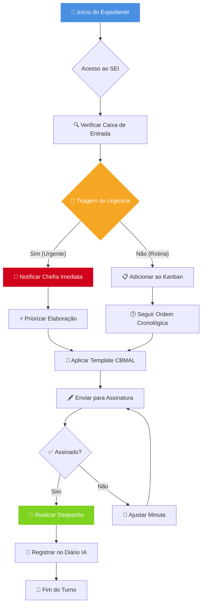

# 🖋️ Fluxo de Trabalho: Agente Secretário (APO/CBMAL)

> [!INFO] **Objetivo**
> Padronizar a rotina diária de processamento de documentos e gestão do SEI para garantir celeridade nas respostas estratégicas.

---

## 🔄 Diagrama de Processo

---

## 📝 Checklist de Qualidade (Pré-Assinatura)
- [ ] O número do processo SEI está correto?
- [ ] Foi utilizado o template oficial do APO?
- [ ] A redação segue o padrão oficial (Sem gírias, impessoal)?
- [ ] Os anexos citados estão realmente incluídos no processo?
- [ ] O destinatário está correto?

---
> [!TIP] **Dica para Excalidraw**
> Você pode copiar o código Mermaid acima e usar a função "Mermaid to Excalidraw" para transformar este fluxo em um desenho editável e personalizado para o mural da seção.

*(Gestão Estratégica Apoiada por Antigravity AI)*
