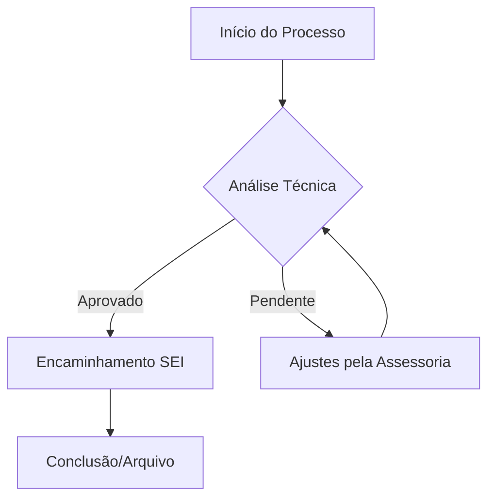

  

# 🚒 Ecossistema de Gestão Estratégica - CBMAL (2025-2029)

> **Orquestração de Inteligência Artificial para Alta Performance Institucional.**

Este repositório é o centro nervoso da **Assessoria de Planejamento Estratégico do Corpo de Bombeiros Militar de Alagoas**. Ele combina automação via IA, gestão visual moderna e rigor metodológico para transformar diretrizes em resultados operacionais.

---

## 🏗️ Pilares do Ecossistema

O projeto integra três frentes de tecnologia para garantir agilidade e rastreabilidade:

### 1. 🤖 Inteligência Agêntica (Antigravity + Gemini)

O **Agente Antigravity** opera através de **Skills** e **Workflows** ultra-otimizados em `.agent`.

- **Skills**: 14 habilidades institucionais, incluindo Redação Oficial (Portaria 18/2024) e **Visual Diagrams Mermaid**.
- **Workflows**: Automações sincronizadas via comandos `/sincronizar`, `/conductor` e `/executar`.

### 2. 📓 Gestão de Conhecimento (Obsidian + PARA)

Toda a documentação segue o método PARA no **Obsidian**:

- **DNA do Sistema**: Registro de decisões pétreas e aprendizado contínuo.
- **Backlinks Semânticos**: Conexões neurais entre legislação, metas e diários.

### 3. 📊 Visualização Premium (BPMN & Mermaid)

- **Mermaid Engine**: Renderização de alta qualidade (SVG/ASCII) integrada ao terminal.
- **Kanban Estratégico**: Gestão de fluxo de valor tático e estratégico.
- **Dashboards Dinâmicos**: Protótipos funcionais para o Comando Geral.

---

## 🚀 Funcionalidades e Exemplos

### 🛠️ Comandos de Comando (Slash Commands)

| Comando | O que ele faz? | Exemplo de Uso |
| :--- | :--- | :--- |
| `/analisar` | Gera insights de desempenho. | "Analise a produção desta semana." |
| `/aprender` | **[NOVO]** Extrai novos padrões e cria Skills automaticamente. | "Aprenda com as últimas interações." |
| `/gerar_pap` | Cria normas técnicas. | "Gere um PAP para o novo fluxo." |
| `/auditoria` | Verifica alinhamento. | "Este despacho está alinhado ao Plano?" |
| `/orquestrar`| Organiza o ambiente. | "Limpe a inbox e conecte as notas da última reunião." |

### 📈 Exemplo de Fluxo BPMN (Visualizável no Obsidian/GitHub)

---

## 📂 Guia de Navegação

- **`01_Gestao_Estrategica/`**: Planos, Metas e Indicadores 2025-2029.
- **`02_Escritorio_Projetos/`**: Documentação de projetos ativos (TAP, EAP).
- **`03_Gestao_Processos/`**: Mapeamentos e Fluxogramas BPMN.
- **`04_Normatizacao_e_Modelos/`**: Portarias, Modelos Word/SEI e Checklists.
- **`05_Controle_Operacional/`**: Dashboards e acompanhamento de metas.
- **`06_Diario_e_Memorias_IA/`**: Registro de evolução e aprendizado da IA.
- **`07_Taxa_de_Bombeiros/`**: Gestão específica da arrecadação e legislação pertinente.

---

## 📖 Documentação de Referência (Acesso Rápido)

Toda a operação do sistema está centralizada no **Cockpit Estratégico**:

### 👉 [**CLIQUE AQUI PARA ENTRAR NO COCKPIT ( 00_START_HERE.md )**](./00_START_HERE.md)

Lá você encontrará:

1. **Painel de Controle**: Status em tempo real.
2. **Manual de Operações**: Lista de comandos (`/insights`, `/aprender`, etc).
3. **Filosofia**: Como operar o agente Conductor.

---
*Assessoria de Planejamento e Orçamento*
