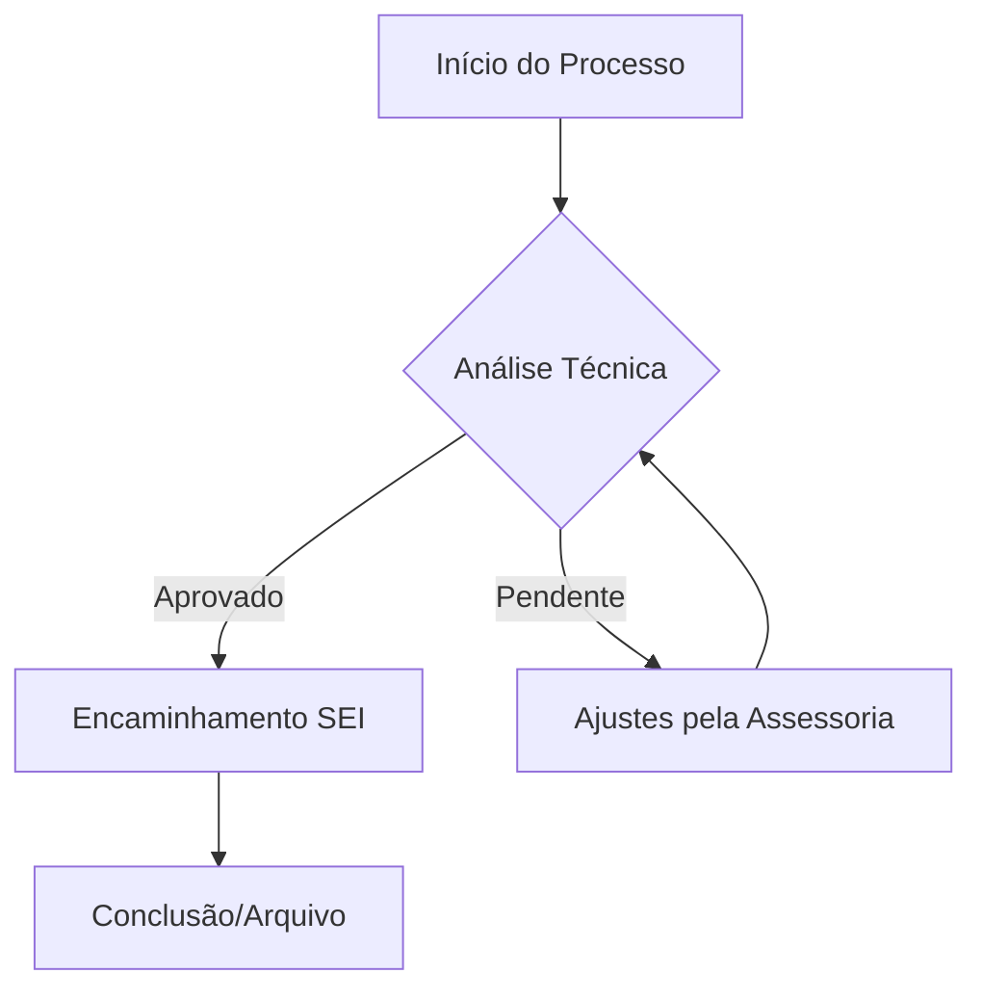

# 🚒 Ecossistema de Gestão Estratégica - CBMAL (2025-2029)

> **Orquestração de Inteligência Artificial para Alta Performance Institucional.**

Este repositório é o centro nervoso da **Assessoria de Planejamento Estratégico do Corpo de Bombeiros Militar de Alagoas**. Ele combina automação via IA, gestão visual moderna e rigor metodológico para transformar diretrizes em resultados operacionais.

---

## 🏗️ Pilares do Ecossistema

O projeto integra três frentes de tecnologia para garantir agilidade e rastreabilidade:

### 1. 🤖 Inteligência Agêntica (Cursor AI + Gemini)
O "Agente Condutor" opera através de **Skills** e **Workflows** customizados, localizados na pasta `.agent`.
- **Skills**: Conhecimento especialista em SEI, Redação Oficial (Portaria 18/2024), Gestão de Projetos e Taxa de Bombeiros.
- **Workflows**: Automações acionáveis por comandos como `/gerar_pap`, `/auditoria_estrategica` e `/analisar`.

### 2. 📓 Gestão de Conhecimento (Obsidian)
Toda a documentação é otimizada para o **Obsidian**, permitindo uma "Segunda Memória" conectada:
- **Conexões Neurais**: Notas interligadas que facilitam a descoberta de dependências entre projetos.
- **Backlinks Semânticos**: Histórico de decisões e reuniões (Diários de Memória) acessível instantaneamente.

### 3. 📊 Visualização e Governança
- **Kanban Estratégico**: Acompanhamento em tempo real de tarefas e metas no arquivo `KANBAN_ESTRATEGICO.md`.
- **Diagramas e BPMN**: Modelagem de processos complexos usando Mermaid.js e padrões BPMN para transparência administrativa.
- **Dashboards de Monitoramento**: Visualização executiva de indicadores (KPIs).

---

## 🚀 Funcionalidades e Exemplos

### 🛠️ Comandos de Comando (Slash Commands)
| Comando | O que ele faz? | Exemplo de Uso |
| :--- | :--- | :--- |
| `/analisar` | Gera insights de desempenho. | "Analise a produção desta semana e atualize o dashboard." |
| `/gerar_pap` | Cria normas técnicas. | "Gere um PAP para o novo fluxo de arrecadação da Taxa." |
| `/auditoria` | Verifica alinhamento. | "Este novo despacho está alinhado ao Plano 2025-2029?" |
| `/orquestrar`| Organiza o ambiente. | "Limpe a inbox e conecte as notas da última reunião." |

### 📈 Exemplo de Fluxo BPMN (Visualizável no Obsidian/GitHub)

---

## 📂 Guia de Navegação

*   **`01_Gestao_Estrategica/`**: Planos, Metas e Indicadores 2025-2029.
*   **`02_Escritorio_Projetos/`**: Documentação de projetos ativos (TAP, EAP).
*   **`03_Gestao_Processos/`**: Mapeamentos e Fluxogramas BPMN.
*   **`04_Normatizacao_e_Modelos/`**: Portarias, Modelos Word/SEI e Checklists.
*   **`05_Controle_Operacional/`**: Dashboards e acompanhamento de metas.
*   **`06_Diario_e_Memorias_IA/`**: Registro de evolução e aprendizado da IA.
*   **`07_Taxa_de_Bombeiros/`**: Gestão específica da arrecadação e legislação pertinente.

---

## 📖 Documentação de Referência

Para uma imersão completa nos processos, consulte os manuais internos:
1.  [**`00_START_HERE.md`**](./00_START_HERE.md): Guia de integração para novos assessores.
2.  [**`MANUAL_DE_COMANDO.md`**](./MANUAL_DE_COMANDO.md): O guia definitivo de como operar a IA e as ferramentas.
3.  [**`CONDUCTOR.md`**](./CONDUCTOR.md): Documentação da arquitetura lógica do sistema.

---
**CBMAL - Por uma Alagoas mais segura.**
*Superintendência de Planejamento e Modernização*
